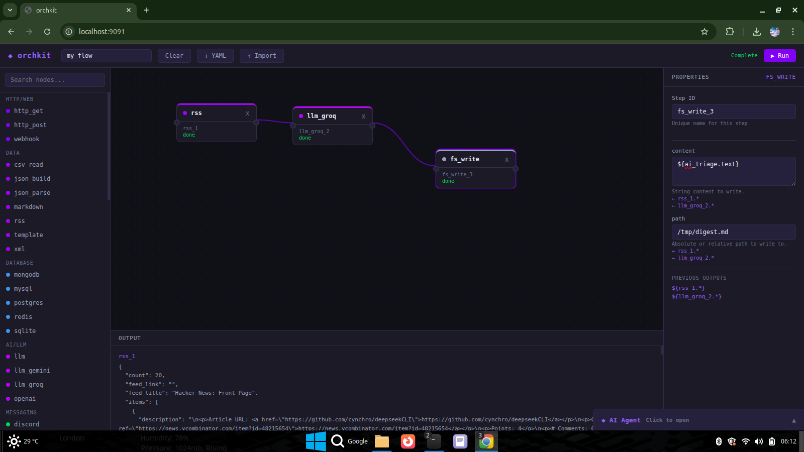

# ◆ orchkit



A composable Go orchestration kernel. Not a platform you deploy — a kit of parts you own.

## What makes it different

| Feature | orchkit | n8n / Temporal / Airflow |
|---------|---------|--------------------------|
| Deployment | Single binary | Docker, server, database |
| Nodes in your code | Yes — import any node | No — locked in platform |
| AI agent arms | Yes — same node, two uses | No |
| MCP server | Built-in | No |
| Visual UI | Built-in | Separate product |
| Dead code elimination | Yes — linker drops unused | No |

## Three ways to use it

**1. YAML flows — no code needed**
```yaml
name: morning-digest
steps:
  - id: fetch
    node: rss
    input:
      url: "https://hnrss.org/frontpage"
      limit: 5
  - id: summarize
    node: llm_groq
    input:
      prompt: "Summarize today's top tech news in 3 bullets"
      max_tokens: 300
  - id: save
    node: fs_write
    input:
      path: "/tmp/digest.md"
      content: "${summarize.text}"
```
```bash
orchkit run morning-digest.yaml
```

**2. Visual UI**
```bash
./orchkit-ui
# Open http://localhost:9091
# Drag nodes, connect them, click Run
```

**3. Go library — drop any node into your project**
```go
import "orchkit/nodes"

node := nodes.NewHTTPGet("https://api.example.com")
out, err := node.Execute(ctx, nil)
```

## 63 nodes across every category

HTTP, JSON, CSV, XML, SQLite, Postgres, MySQL, MongoDB, Redis,
Slack, Discord, Telegram, WhatsApp, Twilio, SMTP,
GitHub, GitLab, Jira, Linear, CircleCI,
HubSpot, Salesforce, Airtable, Pipedrive,
Google Sheets, Gmail, Notion, Trello, Zoom, WordPress,
Shopify, Mailchimp, Stripe, PayPal,
Asana, ClickUp, Todoist, Dropbox, Zendesk,
OpenAI, Groq, Gemini, Anthropic,
RSS, Markdown, Template, Cron, Shell, JWT, SSH, S3, Kafka,
OpenWeather, Spotify, Reddit, Twitter, and more.

## Install

```bash
git clone https://github.com/shaiksadikjanu-cmd/orchkit
cd orchkit
go build -o orchkit ./cmd/orchkit
sudo cp orchkit /usr/local/bin/orchkit
```

## Quick start

```bash
# See all nodes
orchkit nodes

# Get details on a specific node
orchkit node http_get

# Run a flow
orchkit run my-flow.yaml

# Start the visual UI
./orchkit-ui
# Open http://localhost:9091
```

## Engine features

- Sequential, parallel, and conditional steps
- Per-step timeouts
- Retry wrapper
- Branch (if/else) and Loop nodes
- Flow composition — flows inside flows
- Hooks for observing execution
- Graceful shutdown on SIGTERM
- BoltDB and Postgres persistence

## AI integration

Every node is simultaneously a Go function and an AI tool:

```go
// Use as an AI agent's arms
result, err := ai.Run(ctx, ai.AgentConfig{
    GroqAPIKey: os.Getenv("GROQ_API_KEY"),
    Nodes: []orchkit.Node{
        nodes.NewHTTPGet(""),
        nodes.NewJSONParse(""),
        nodes.NewFSWrite(""),
    },
}, "Fetch the HN front page and save the top 3 titles to /tmp/hn.txt")
```

## MCP server — Claude Desktop integration

```bash
go build -o orchkit-mcp ./cmd/orchkit-mcp
```

Add to `~/.config/claude/claude_desktop_config.json`:
```json
{
  "mcpServers": {
    "orchkit": {
      "command": "/path/to/orchkit-mcp",
      "env": {
        "GROQ_API_KEY": "your_key"
      }
    }
  }
}
```

Restart Claude Desktop. All 63 nodes become tools Claude can call.

## Adding a custom node

See [CUSTOM_NODE.md](CUSTOM_NODE.md) for a complete guide.

## License

MIT
